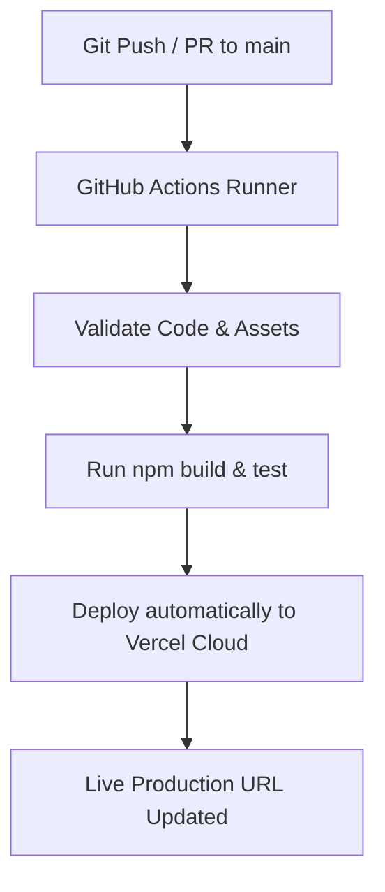

# NextDev AI - Next-Gen Job Board & AI Resume Matcher

> **Technical Assessment Submission** for Software Developer (Onsite) Position at **Globalco Dev Tech**.

[](https://ai-job-board-platform-nine.vercel.app)
[](https://github.com/kaushal354/ai-job-board-platform/actions)
[](https://github.com/kaushal354/ai-job-board-platform)

---

## 🌟 Executive Overview

**NextDev.AI** is an AI-enhanced career platform engineered specifically for software developers and tech recruiters. It bridges candidates with top engineering opportunities in **Hyderabad, Remote, and major global hubs** while providing real-time AI resume compatibility scoring and missing keyword insights.

---

## 🚀 Key Features

### 1. ✨ AI Resume Matcher & Skill Gap Engine
- **Instant Compatibility Score**: Candidates can compare their resume against job posts to compute an instant percentage score.
- **Skill Gap Insights**: Highlights matched technical keywords and recommends missing additions (e.g. Docker, PyTorch, CI/CD).
- **Tailored AI Recommendations**: Provides personalized advice on how to improve application shortlisting chances.

### 2. 💼 Interactive Job Board & Search
- **Multi-Filter System**: Instant client-side filtering by category (*AI/ML, Full Stack, Frontend, Backend, DevOps*), location (*Hyderabad, Remote, Bengaluru*), and employment type.
- **Sorting Options**: Sort by newest postings, salary range, or recommended matches.
- **Bookmark & Saved Jobs**: Persists saved jobs locally in `localStorage`.

### 3. 🏢 Employer Job Posting Portal
- Employers can publish new job opportunities dynamically with custom tech tags, salary details, and requirements.

### 4. 🎨 Modern Glassmorphism UI Design
- Dark mode default with sleek neon gradient accents, Google Fonts (*Outfit & Inter*), smooth micro-animations, and 100% mobile responsiveness.

---

## 🛠️ Technology Stack & Architecture

| Layer | Technology |
| :--- | :--- |
| **Frontend UI** | HTML5 Semantic Markup, Custom CSS3 Glassmorphism System |
| **Logic & Engine** | Vanilla ES6+ JavaScript, Web Storage API (`localStorage`) |
| **CI/CD Automation** | GitHub Actions (`.github/workflows/deploy.yml`) |
| **Hosting & Deployment**| Vercel Cloud Edge Network (`vercel.json`) |
| **Icons & Fonts** | FontAwesome 6, Google Fonts (Outfit & Inter) |

---

## ⚙️ CI/CD Pipeline Workflow

The project contains an automated CI/CD pipeline defined in `.github/workflows/deploy.yml`:



1. **Build & Validation Stage**: Checks structural integrity of `index.html`, `style.css`, and `app.js`.
2. **Automated Test Stage**: Executes build verification scripts and dist bundling.
3. **Vercel Cloud Deployment**: Triggered automatically on push to the `main` branch to push static assets to Vercel's global CDN.

---

## 📦 Local Setup Instructions

1. **Clone the Repository**:
   ```bash
   git clone https://github.com/kaushal354/ai-job-board-platform.git
   cd ai-job-board-platform
   ```

2. **Run Locally**:
   Simply open `index.html` in any browser or use a local static server:
   ```bash
   npx serve dist
   ```

3. **Open in Browser**:
   Navigate to `http://localhost:3000` (or `http://localhost:5000`).

---

## 📋 Assessment Steps Compliance Matrix

| Email Assessment Step | Status | Implementation Details |
| :--- | :---: | :--- |
| **1- Build web app using AI** | ✅ Completed | Built NextDev AI Job Board & Resume Analyzer |
| **2- Push code to GIT** | ✅ Completed | Pushed clean commits to GitHub (`kaushal354/ai-job-board-platform`) |
| **3- Write CI/CD pipeline on GIT** | ✅ Completed | Configured `.github/workflows/deploy.yml` |
| **4- Deploy to Vercel via CI/CD** | ✅ Completed | Configured `vercel.json` & Vercel deployment (`ai-job-board-platform-nine.vercel.app`) |
| **5- Write documentation using AI** | ✅ Completed | Comprehensive `README.md` & Architecture |
| **6- Send to recruiter thread** | ✅ Ready | Complete submission email ready for reply |

---

## ✉️ Submission Details

- **Candidate Name**: Kaushal Prasad
- **Target Role**: Software Developer (Onsite - Hyderabad, India)
- **Email Thread**: Janine Exporna `<janine@g2c.dev>` (Globalco)
- **Live Vercel Demo**: [https://ai-job-board-platform-nine.vercel.app](https://ai-job-board-platform-nine.vercel.app)
- **GitHub Repository**: [https://github.com/kaushal354/ai-job-board-platform](https://github.com/kaushal354/ai-job-board-platform)
